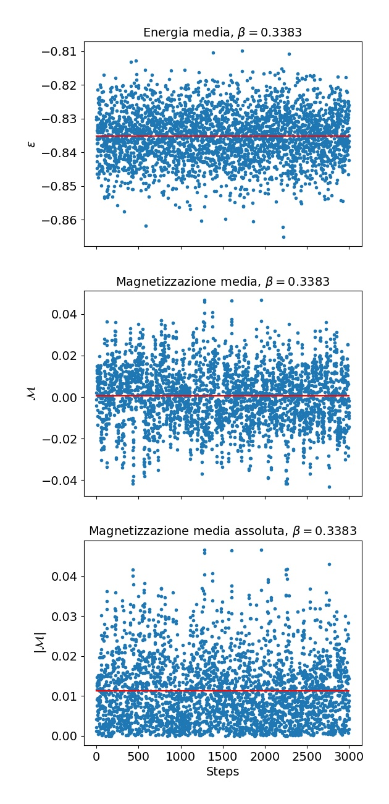
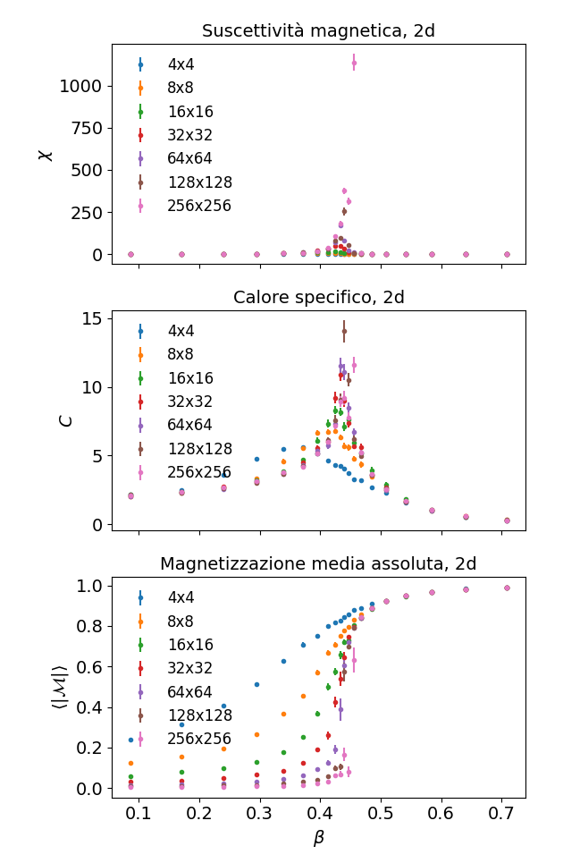

# Numerical simulation of Ising model on GPU with CUDA

This project is about using driver CUDA to execute the code faster on the GPU than on the CPU.

I simulated the Ising model (a simple model for ferromagnetism in matter) employing a MonteCarlo Mark Chain (MCMC).
The simulation is performed in C (using CUDA driver), the analysis results are computed in python.

A time comparison between pure C and Cuda is reported [below](#time-comparison).

## Prerequisites
- Windows 10 or a Linux distribution with a compatible kernel
  (https://docs.nvidia.com/cuda/cuda-installation-guide-linux/index.html#system-requirements)

- A compatible GPU (see https://developer.nvidia.com/cuda-gpus)
  
- Python 3 

## Installation

1. Clone this repo on your computer
   ```bash
   $ git clone https://github.com/federicovisintini/ising-gpu.git
   ```

2. (recommended) Create a virtual enviroment
   ```bash
   $ cd ising-gpu
   $ python3 -m venv isingvenv
   ```
   and activate it
   ```bash
   $ source isingvenv/bin/activate
   ```
   
3. Install the requirements
   ```bash
   $ pip install -r requirements.txt
   ```
   
4. Install CUDA following the offical [docs](https://docs.nvidia.com/cuda/cuda-installation-guide-linux/index.html)

## Usage
The C and the CUDA files will generate a Markov Chain of energy and magnetisation of the system each.
Results are saved in `/data` in `.dat` files.

- Run C code with the following
    * Modify the relevant parameters in lines 7-13 of `dim2.c`,
      expecially the **path** where the results will be saved in and the **lattice spacing**
    * Compile `dim2.c` in an executable called `dim2c` with
      ```bash
      $ gcc dim2.c -o dim2c -lm
      ```
    * Execute `dim2c` to generate result
      ```bash
      $ ./dim2c
      ```
      Note: to time the execution time just type `$ time ./dim2c` instead.

- Run CUDA code with the following
    * Modify the relevant parameters in lines 11-19 of `dim2.cu`,
      expecially the **path** where the results will be saved in and the **lattice spacing**
    * Compile `dim2.cu` in an executable called `dim2cu` with
      ```bash
      $ nvcc dim2.cu -o dim2cu -lcurand
      ```
    * Execute `dim2cu` to generate result
      ```bash
      $ ./dim2cu
      ```
      Note: to time the execution time just type `$ time ./dim2cu` instead.

- Error analysis at given lattice spacing and temperature
    * Run `$ python single_temperature_err_analysis.py` to compute the mean quantities
      (energy, magnetization, suscettibility) and associated errors. 
      techniques are used to take into account autocorrelation between the measures.
      
      The script runs on files named `data/lattice*cu.dat`.
    
- Run `$ python multiple_temperature.py` to a comprehesive analysis of mean quantities
  around phase transition temperature and dependance from latting spacing.
  
  The script runs on files named `data/lattice*cu.dat`.

## Example of Results
Plotting the energy and magnetization vs its position in the markov chain
should result in something like this:



Computing suscettibility, specific heat and magnetization varying the temperature
(β~1/T) sould result instead in something like this:



## Time Comparison
We compared the time it took to execute a simulation of our system
for some fix parameter and varying the lattice dimension for C and CUDA scrips.

The number of steps between measures is proportional to *lattice* x *lattice*,
so we expect a quadratic (in 2D) increase in computational time
(x4 in table rows, since doubling the lattice points each time).

|    lattice     |   C code runtime (s)  |   CUDA code runtime (s)   |
|----------------|-----------------------|---------------------------|
|        4       |         0.221         |            5.364          |    
|        8       |         0.719         |            5.597          |
|        16      |         2.431         |            5.723          |
|        32      |         9.806         |            7.564          |
|        64      |        38.655         |           14.874          |
|        128     |       148.755         |           47.485          |
|        256     |       630.897         |          169.416          |

We see that for a relatively large *lattice* (ca >30 points),
the CUDA program is actually faster than the C code.


# Licence
This work is licenced under GNU GPLv3 by Federico Visintini.

See `LICENSE` for more information.
